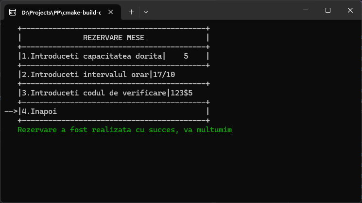

# PP
Console Application made for a college course (personal project) used for managing reservations at a restaurant. The user is able to make a reservation, verify if a reservation is still active (using the code they picked) and cancel a reservation. I also made a administrator menu where all the reservations can be viewed and manipulated (removed, created). The menu is easy to navigate using W, S Keys and Enter. 

##Exemple use

